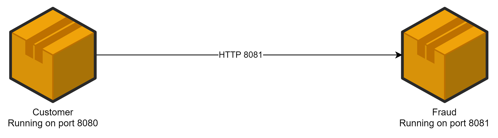
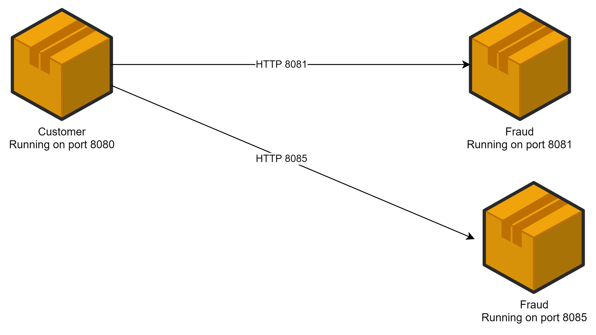
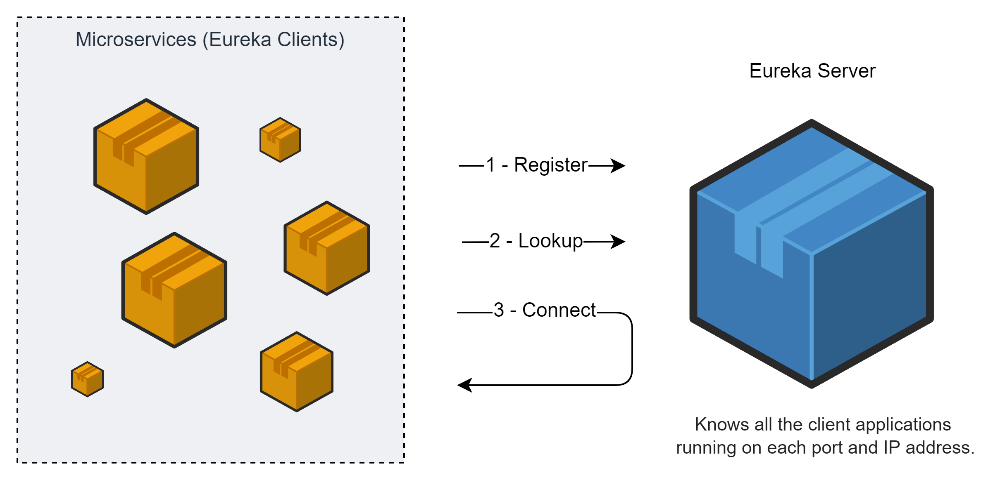
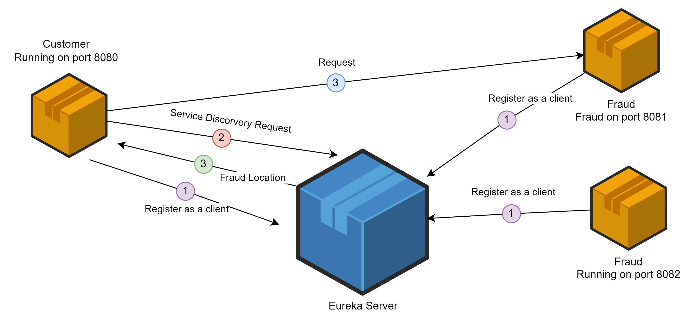

### Create a spring boot banner
[link to create spring boot banner](https://devops.datenkollektiv.de/banner.txt/index.html) 
then generate the banner and place it to the `resources/banner.txt`  

### Start postgresql and pgadmin in docker as services using docker-compose.yml
[link to docker-compose](docker-compose.yml)  
`cd {root of the project where docker-compose.yml placed}`   
run `docker compose up -d`  
check running `docker compose ps`  
go to pgAdmin webUI `localhost:5050`  
add NewServer with any name and hostName/address = postgres  
we set `hostName` as `postgres`(it's a `network`), 
because `pgAdmin service` and `postgres service` 
connect with each other inside the `docker container` by `network = postgres`

### Register new customer by curl request using git bash
`curl --location --request POST 'localhost:8080/api/v1/customers' --header 'Content-Type: application/json' --data-raw '{"firstName": "tim","lastName": "dzha","email": "tim@gmail.com"}'`

### Customer and FraudCheck microservices communication
#### Customer runs on 8080 and  FraudCheck runs on 8081 port
1. One To One Instance Rest Communication

2. One To Many Instances Rest Communication

It's hard for Customer service discover all FraudCheck services  
Let's use Eureka Server

#### Eureka Server

In our projects the diagram will looks like that

Eureka Server running on 8761.  
We see dashboard  
Configure Customer microservice as a Eureka Client  
Then start two instances of Customer MS
1. in Idea `EditConfigurations` of CustomerApplication
2. duplicate it, rename as CustomerApplication2
3. in `Configuration/Environment` set `ProgramArguments = --server.port=8085`
4. start CustomerApplication2
5. we see in Eureka Server Dashboard to instances

But we should understand that Eureka Server now seems like a bottle-neck.   
If it falls down, all microservices will fail. 

### Frameworks and libs
#### Spring Cloud
[link to habr post](https://habr.com/ru/company/jugru/blog/341026/)
Spring Cloud — это модуль Spring для разработки микросервисной архитектуры. 
Одна из основных вещей, которые там есть — это Service Discovery.
Service Discovery обычно бесполезен отдельно от Load Balancer,
и в Spring Cloud для этого есть Spring Cloud Netflix —
проект с имплементацией Discovery для Eureka Server и
клиентским балансировщиком — Ribbon и Feign.

Spring Cloud Starter Ribbon — интеграция клиентского балансировщика Ribbon
в привычный стек Spring MVC (RestTemplate) и связка его с Service Discovery.
Spring Cloud Starter OpenFeign — декларативный клиент для того,
чтобы делать клиенты в стиле RPC, для удобного общения сервисов через HTTP.
Само собой, он имеет интеграцию с упомянутыми ранее решениями (Ribbon/Discovery).

Действительно, часть трудностей берёт на себя Spring Cloud 
(например, реализация балансировки и клиентское обнаружение). 
Так, целую пачку новых вызовов привносят совершенно обычные, 
с точки зрения разработки, вещи. 
Приходится смотреть на типичные вещи под углом функционирования системы в целом 
(а я напомню, в случае монолитного приложения это было просто супер). 
Например, теперь недостаточно написать сообщение об ошибке в лог, 
нужно позаботиться о прозрачности его нахождения, 
добавляя к нему метаинформацию для сквозного поиска вызовов, 
участвующих в ошибочном запросе. 

#### Spring Cloud Sleuth
INFO [customer,,]
INFO [fraud,,]
INFO [notification,,]

we can see in logs of microservices
INFO [{microservice}, {traceId}, {spanId}]
INFO [customer,36d9913310cf03f5,36d9913310cf03f5]
INFO [fraud,36d9913310cf03f5,e7339e849775a683]
INFO [notification,36d9913310cf03f5,f7e8b33e7da6873f]

Для этого есть решения типа Spring Cloud Sleuth, 
которые добавляют различную метаинформацию в логи, 
позволяют получать «сквозные» логи по ошибкам, 
производят семплинг запросов и отправляют их на Zipkin-сервер. 
С помощью интерфейса Zipkin уже можно удобно искать «топ самых медленных запросов»,
вычислять «грязных утят» — конкретные тормозящие сервисы,
быстро оценивать ситуацию и локализовывать проблему.

Одна из насущных задач, существующих в мире микросервисов — 
это максимально автоматизировать механизм обнаружения друг другом таких микросервисов, 
которые не знают о местонахождении друг друга. 
Они знают, что в принципе существуют какие-то другие микросервисы, 
к которым можно обращаться и что-то от них получать, 
но они не знают, куда обращаться, 
потому что сегодня мы это запускаем на одном кластере, 
завтра — на другом, послезавтра мы это запускаем на Amazon, потом ещё где-то. 
Примером модуля, входящего в мир Spring Cloud, является Service Discovery, 
через который все микросервисы могут узнать о местонахождении друг друга.

