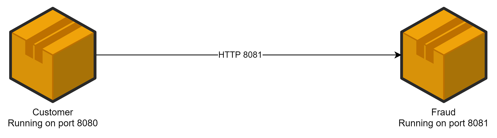
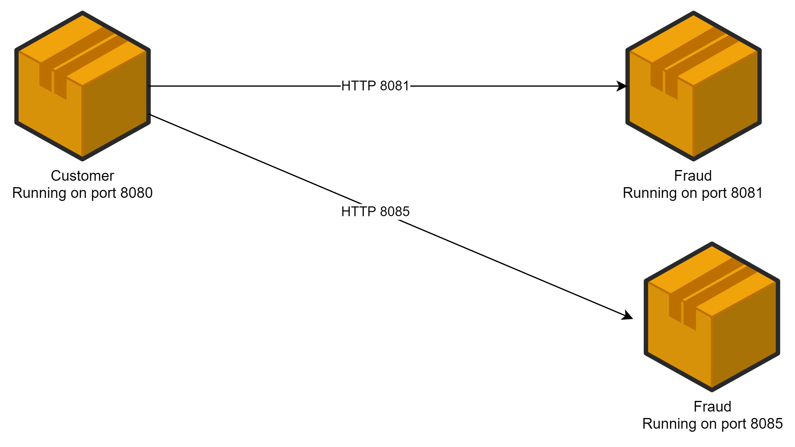
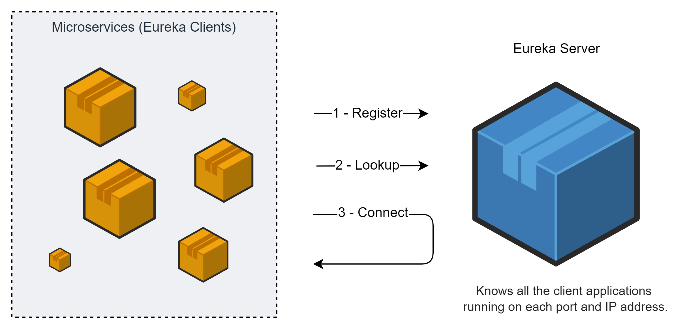
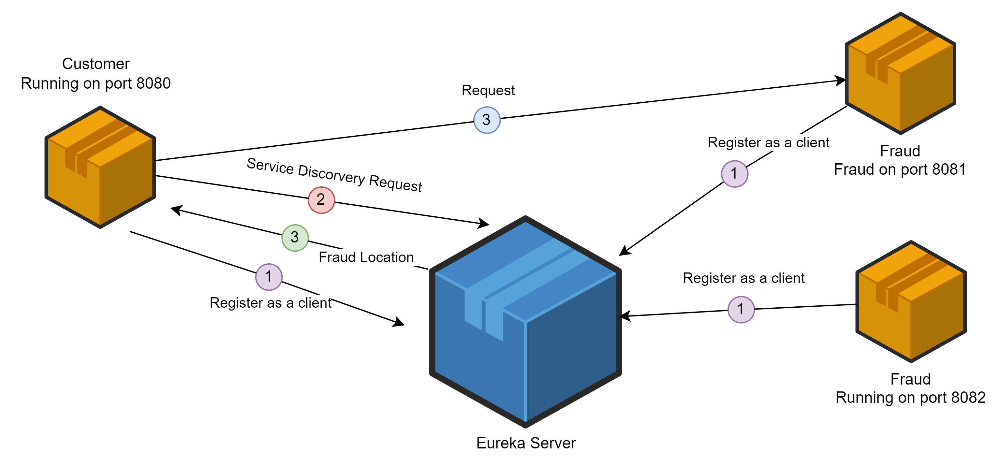
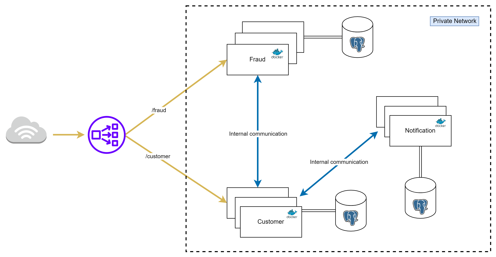

1. [Spring boot banner](resources/md/springboot-banner.md)
2. [Docker services](resources/md/docker-services.md)  
3. Spring Cloud  
3.1. [Spring cloud sleuth](resources/md/spring-cloud-sleuth.md)

### Register new customer by curl request using git bash
`curl --location --request POST 'localhost:8080/api/v1/customers' --header 'Content-Type: application/json' --data-raw '{"firstName": "tim","lastName": "dzha","email": "tim@gmail.com"}'`

## Spring Cloud
[link to habr post](https://habr.com/ru/company/jugru/blog/341026/)
Spring Cloud — это модуль Spring для разработки микросервисной архитектуры.
Одна из основных вещей, которые там есть — это Service Discovery.
Service Discovery обычно бесполезен отдельно от Load Balancer,
и в Spring Cloud для этого есть Spring Cloud Netflix —
проект с имплементацией Discovery для Eureka Server и
клиентским балансировщиком — Ribbon и Feign.

Spring Cloud Starter Ribbon — интеграция клиентского балансировщика Ribbon
в привычный стек Spring MVC (RestTemplate) и связка его с Service Discovery.
Spring Cloud Starter OpenFeign — декларативный клиент для того,
чтобы делать клиенты в стиле RPC, для удобного общения сервисов через HTTP.
Само собой, он имеет интеграцию с упомянутыми ранее решениями (Ribbon/Discovery).

Действительно, часть трудностей берёт на себя Spring Cloud
(например, реализация балансировки и клиентское обнаружение).
Так, целую пачку новых вызовов привносят совершенно обычные,
с точки зрения разработки, вещи.

### Service Discovery
Customer and FraudCheck microservices communication  
Customer runs on 8080 and  FraudCheck runs on 8081 port
1. One To One Instance Rest Communication

2. One To Many Instances Rest Communication

It's hard for Customer service discover all FraudCheck services  
Let's use Eureka Server

#### Eureka Server

In our projects the diagram will looks like that

Eureka Server running on 8761.  
We see dashboard  
Configure Customer microservice as a Eureka Client  
Then start two instances of Customer MS
1. in Idea `EditConfigurations` of CustomerApplication
2. duplicate it, rename as CustomerApplication2
3. in `Configuration/Environment` set `ProgramArguments = --server.port=8085`
4. start CustomerApplication2
5. we see in Eureka Server Dashboard to instances

But we should understand that Eureka Server now seems like a bottle-neck.   
If it falls down, all microservices will fail. 

Одна из насущных задач, существующих в мире микросервисов —
это максимально автоматизировать механизм обнаружения друг другом таких микросервисов,
которые не знают о местонахождении друг друга.
Они знают, что в принципе существуют какие-то другие микросервисы,
к которым можно обращаться и что-то от них получать,
но они не знают, куда обращаться,
потому что сегодня мы это запускаем на одном кластере,
завтра — на другом, послезавтра мы это запускаем на Amazon, потом ещё где-то.
Примером модуля, входящего в мир Spring Cloud, является Service Discovery,
через который все микросервисы могут узнать о местонахождении друг друга.

#### Zipkin Server
[link to Zipkin](https://zipkin.io/pages/quickstart)  
add to docker compose file zipkin service and start  
[Zipkin runs on http://127.0.0.1:9411/zipkin/](http://127.0.0.1:9411/zipkin/)  

С помощью интерфейса Zipkin уже можно удобно искать «топ самых медленных запросов»,
вычислять «грязных утят» — конкретные тормозящие сервисы,
быстро оценивать ситуацию и локализовывать проблему.

### Load Balancer

TLS
Certificate Management
Authentication
High Availability
Logging
Caching
Path Based Routing

### Spring Cloud Gateway
This project provides a library for building an API Gateway on top of Spring WebFlux. 
Spring Cloud Gateway aims to provide a simple, yet effective way to route to APIs and 
provide cross cutting concerns to them such as: security, monitoring/metrics, and resiliency.

Never manage Load Balancer yourself
Use Google Load Balancing, AWS Load Balancing or etc
