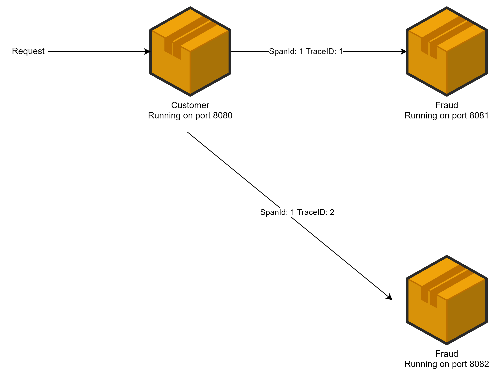

# Spring Cloud Sleuth
В микросервисах недостаточно написать сообщение об ошибке в лог,
нужно позаботиться о прозрачности его нахождения,
добавляя к нему метаинформацию для сквозного поиска вызовов,
участвующих в ошибочном запросе.

INFO [customer,,]
INFO [fraud,,]
INFO [notification,,]

we can see in logs of microservices
INFO [{microservice}, {traceId}, {spanId}]
INFO [customer,36d9913310cf03f5,36d9913310cf03f5]
INFO [fraud,36d9913310cf03f5,e7339e849775a683]
INFO [notification,36d9913310cf03f5,f7e8b33e7da6873f]

Для этого есть решения типа Spring Cloud Sleuth,
которые добавляют различную метаинформацию в логи,
позволяют получать «сквозные» логи по ошибкам,
производят семплинг запросов и отправляют их на Zipkin-сервер.

